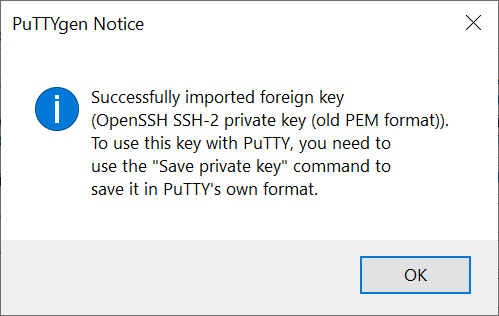
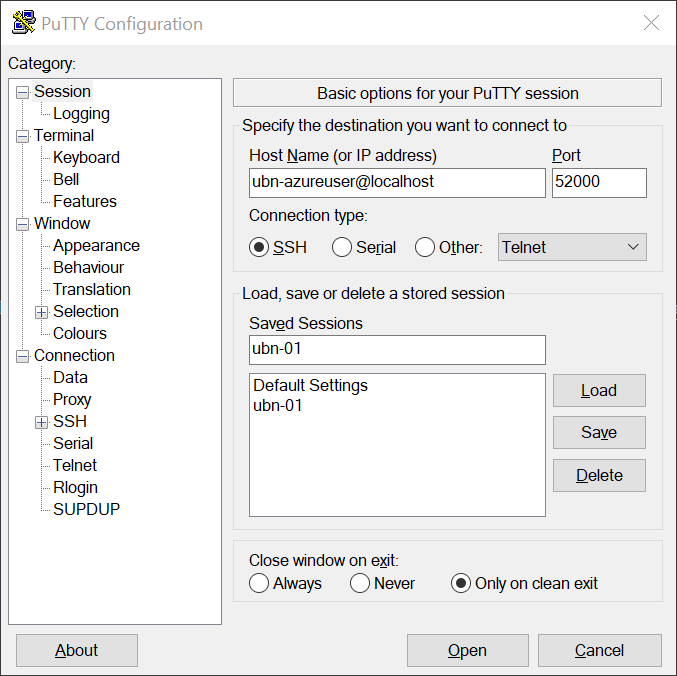
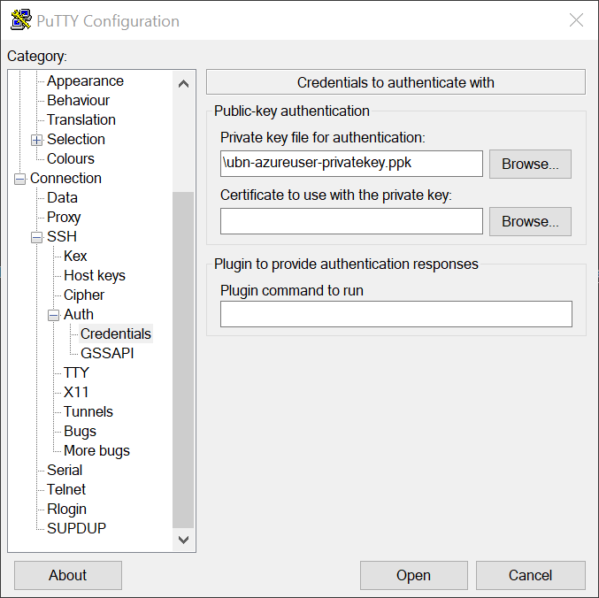
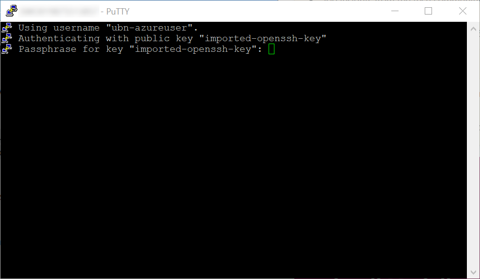
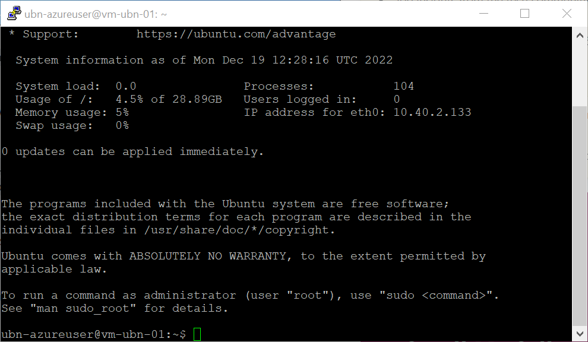

# Use PuTTY to access an Azure Linux VM through Bastion

## Summary

I was testing Azure Bastion and wanted to deploy a test environment through terraform. The steps below were performed to create a Linux VM for testing and accessing it through PuTTY.  

- use terraform to deploye the Linux VM and create the corresponding SSH key.
- use terraform output to create the corresponding PEM file.
- use puttygen to convert the PEM file to PPK format.
- use th Azure CLI to create a port forwarding from the local machine to Azure Bastion.
- use PuTTY to connect to the Azure Linux VM.


## Deploy

For simplicity, only the VM deployment part is represented here. If you'd like to take a look at the full test environment, please see the [Test Azure Bastion](Test_Azure_Bastion.md) document.

Basically, within the terraform documentation, an SSH Key needs to be created.

```terraform
# Create an SSH key
resource "tls_private_key" "ubn_ssh" {
  algorithm = "RSA"
  rsa_bits  = 4096
}
```

This key will then need to be referenced in the VM configuration part of the terraform configuration. 

```terraform
# Create virtual machine
resource "azurerm_linux_virtual_machine" "vm_ubn_01" {
  name                  = "vm-ubn-01"
  location              = azurerm_resource_group.rg.location
  resource_group_name   = azurerm_resource_group.rg.name
  network_interface_ids = [azurerm_network_interface.nic_ubn_01.id]
  size                  = "Standard_DS1_v2"

  os_disk {
    name                 = "disk-os-ubn-01"
    caching              = "ReadWrite"
    storage_account_type = "Premium_LRS"
  }

  source_image_reference {
    publisher = "Canonical"
    offer     = "UbuntuServer"
    sku       = "18.04-LTS"
    version   = "latest"
  }

  computer_name                   = "vm-ubn-01"
  admin_username                  = "ubn-azureuser"
  disable_password_authentication = true

  admin_ssh_key {
    username   = "ubn-azureuser"
    public_key = tls_private_key.ubn_ssh.public_key_openssh
  }
}
```

## Extract Private Key

Note that the key will be part of the state file in raedable text. Since it is printed in one line, includes line breaks and is therefore difficult to extract manually, we could use a terraform [`output`](https://stackoverflow.com/questions/49743220/how-do-i-create-an-ssh-key-in-terraform) for extracting the key. [2]

```terraform
output "tls_private_key" {
  value     = tls_private_key.ubn_ssh.private_key_pem
  sensitive = true
}
```

In order to extract the key into a file, we can then use the command line:

```bash
$ terraform output -raw tls_private_key > ubn_private_key.pem
```

## Convert PEM to PPK

In order to be able to use the key with PuTTY, we will need to convert it into the PPK format using [PuTTYgen](https://the.earth.li/~sgtatham/putty/0.78/htmldoc/Chapter8.html#pubkey-puttygen). [3] Unfortunately there does not seem to be a way to do this via the commandline on Windows. The linux version of puttygen includes the corresponding options though, which is why there are a limited options: [Maybe use WinSCP](https://superuser.com/questions/912304/how-do-you-convert-an-ssh-private-key-to-a-ppk-on-the-windows-command-line), stick to the PuTTYgen graphical user interface or use WSL (and therefore Linux). [4]

Using the GUI, the conversion could work like this:

1. Open PuTTYgen
2. Load the previously created key (which will bring up the following message):

   

3. Add and confirm a key passphrase.
4. Save the private key as ppk file.

## Create Port Forwarding

Now that all prerequisites are in place, we can create the port forwarding using the following Az CLI command.

```azurecli
az network bastion tunnel --name bastion-host --resource-group bastion-test-rg --target-resource-id /subscriptions/{subscription-id}/resourceGroups/bastion-test-rg/providers/Microsoft.Compute/virtualMachines/vm-ubn-01 --resource-port 22 --port 52000
```

Once the tunnel is established, the console would indicate that it is waiting for incoming connectons:

```azurecli
Command group 'network bastion' is in preview and under development. Reference and support levels: https://aka.ms/CLI_refstatus
Opening tunnel on port: 52000
Tunnel is ready, connect on port 52000
Ctrl + C to close
```

## Connect

For connecting we need to make sure that we are using the appropriate user that was created through terraform (ubn-azureuser) and that we are connecting against the previously opened port 52000 on `localhost`.



Furthermore, we need to point PuTTY to the appropriate ppk file.



Now, we can open the connection and will be asked for the passphrase for the private key.



Once that is done, the conection will be authenticated.




## References
| # | Title | URL | Accessed On |
| --- | --- | --- | --- |
| 1 | PuTTY: latest release | https://www.chiark.greenend.org.uk/~sgtatham/putty/latest.html | 2022-12-19 |
| 2 | How do I create an SSH key in Terraform? | https://stackoverflow.com/questions/49743220/how-do-i-create-an-ssh-key-in-terraform | 2022-12-19 |
| 3 | PuTTY Documentation - Chapter 8: Using public keys for SSH authentication | https://the.earth.li/~sgtatham/putty/0.78/htmldoc/Chapter8.html#pubkey-puttygen | 2022-12-19 |
| 4 | How do you convert an SSH private key to a .ppk on the Windows command line? | https://superuser.com/questions/912304/how-do-you-convert-an-ssh-private-key-to-a-ppk-on-the-windows-command-line | 2022-12-19 |
