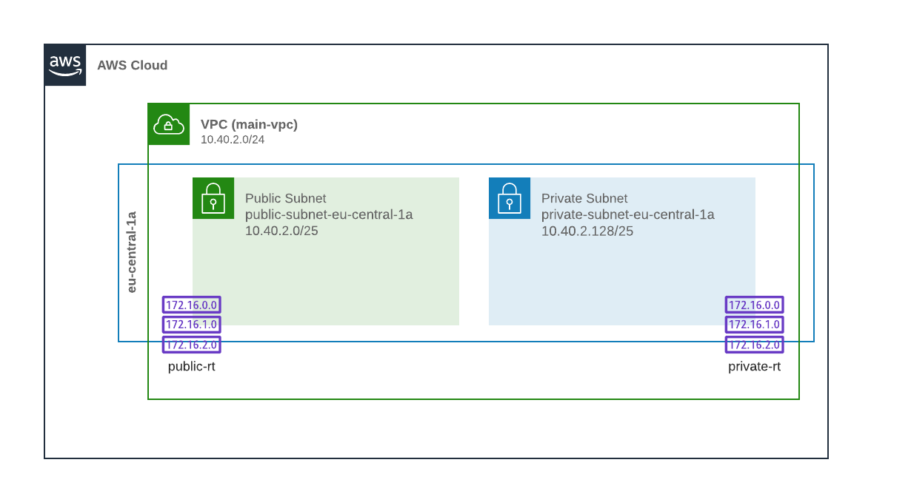
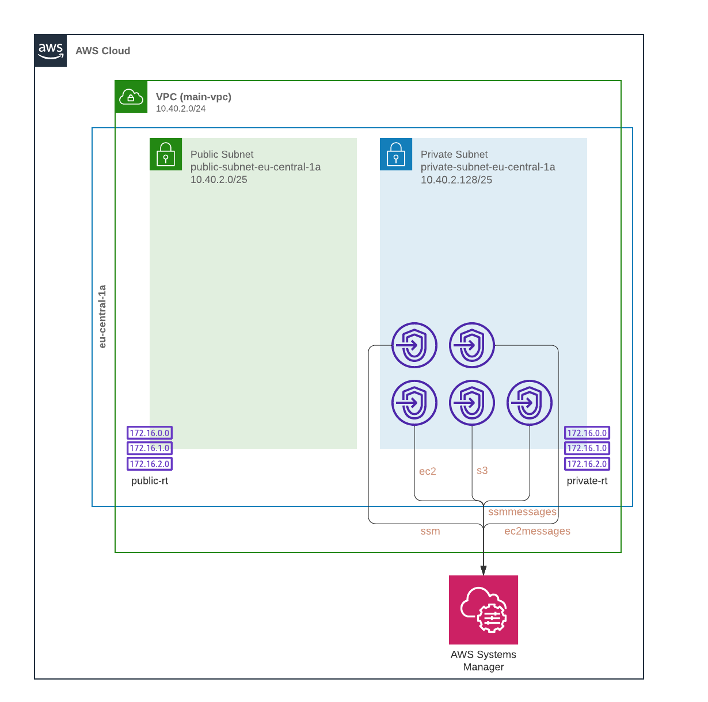
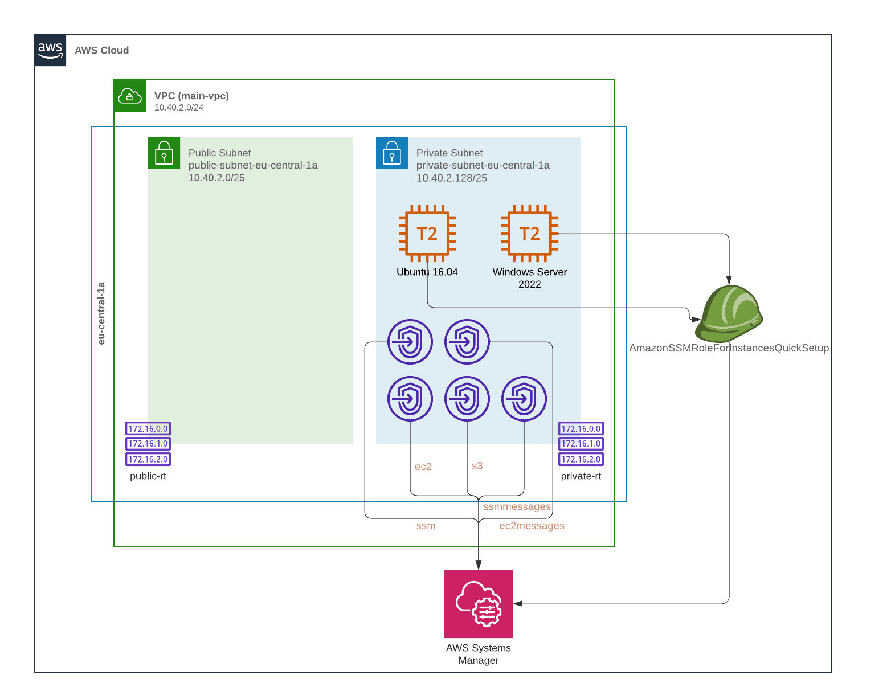
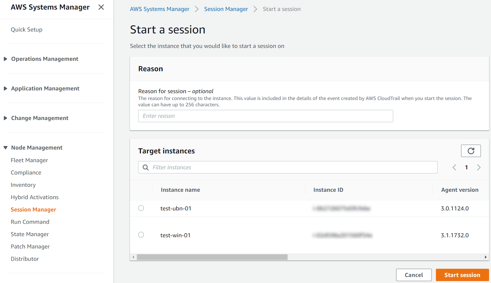
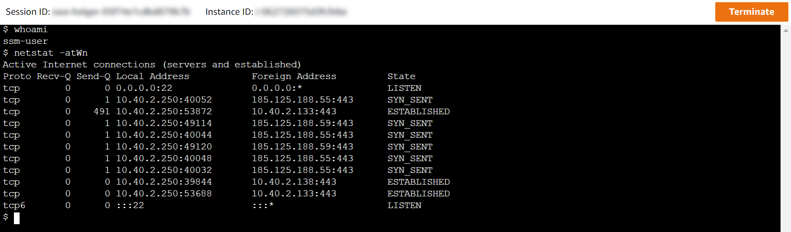
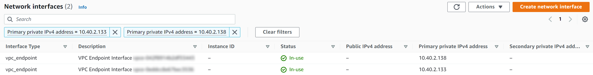
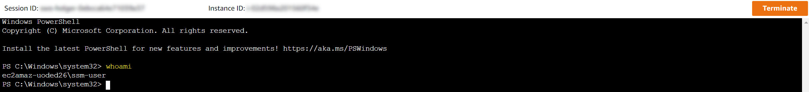
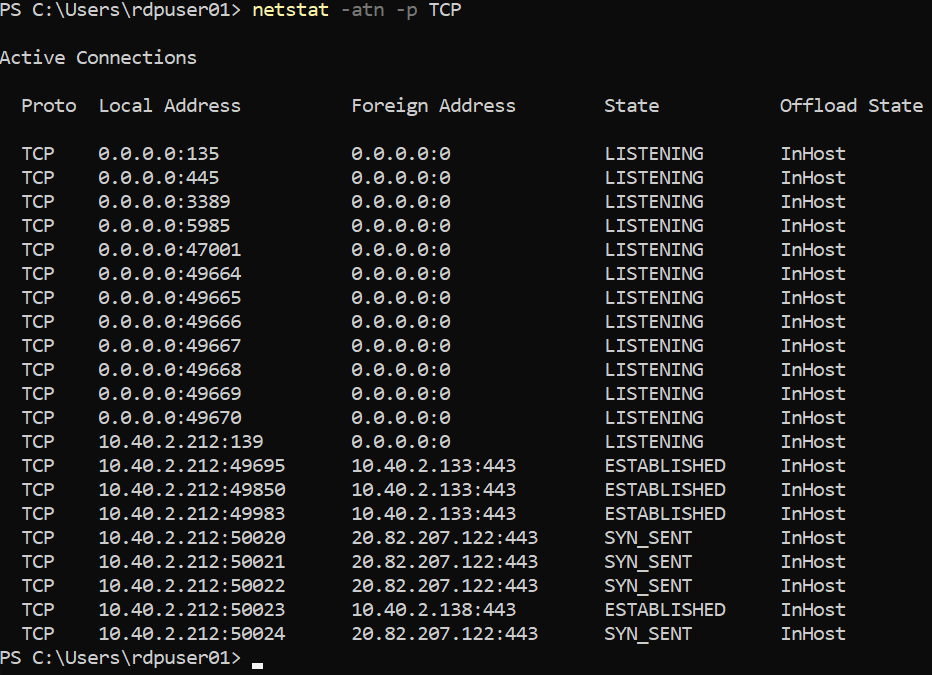

## Objective: Testing AWS Session Manager with VPC Endpoints

Based on the AWS documentation, AWS Session Manager can be used to establish interactive sessions against EC2 instances that are fully private - without any outbound or inbound internet traffic required or even allowed.
In order for this to work VPC Interface Endpoints for AWS Systems Manager Session Manager are required, since the AWS Systems Manager agents need to communicate with AWS Systems Manager.

**The steps in this document can be used to test AWS Systems Manager Session Manager functionality through VPC Endpoints using a simple setup based on terraform. The code samples are solely for testing and learning purposes and should not be used in production environments.**

The terraform code snippets can be used to deploy the following resources:

- 1 VPC, including one public and one private subnet, one route table and the corresponding subnet associations.
- 5 VPC Endpoints (4 Interface Endpoints, 1 Gateway Endpoint)
- 1 Security Group
- 2 EC2 Instances for testing AWS Session Manager (1 Windows- and 1 Linux-Instance)

Although a public subnet is part of the configuration, an internet gateway is _not_ part of the test deployment. This is on purpose since the objective is to allow only internal traffic anyways.

## Creating the VPC

As a first step, the VPC needs to be created. For the steps in this document, this will be done in the eu-central-1 region and for simplicity reasons the subnets are only spread across a single availability zone (eu-central-1a). Please see here for a [list of AWS Regions and Zones](https://docs.aws.amazon.com/AWSEC2/latest/UserGuide/using-regions-availability-zones.html) and how to query them [1]. 

From a VPC perspective, these resources would need to be deployed first.



In terraform code this could be represented like this:

```terraform
# Create VPC
resource "aws_vpc" "main_vpc" {
    cidr_block = "10.40.2.0/24"
    instance_tenancy = "default"
    enable_dns_hostnames = true
    enable_dns_support = true
    tags = {
        Name = "main-vpc"
        owner = "me"
    }
}

# Create Subnets
resource "aws_subnet" "main_public_subnet" {
    vpc_id = aws_vpc.main_vpc.id
    availability_zone = "eu-central-1a"
    cidr_block = "10.40.2.0/25"
    tags = {
        Name = "public-subnet-eu-central-1a"
        owner = "me"
    }
}

resource "aws_subnet" "main_private_subnet" {
    vpc_id = aws_vpc.main_vpc.id
    availability_zone = "eu-central-1a"
    cidr_block = "10.40.2.128/25"
    tags = {
        Name = "private-subnet-eu-central-1a"
        owner = "me"
    }
}

# Create Route Tables and the corresponding associations
resource "aws_route_table" "main_public_rt" {
    vpc_id = aws_vpc.main_vpc.id
    tags = {
        Name = "public-rt"
        owner = "me"
    }
}

resource "aws_route_table" "main_private_rt" {
    vpc_id = aws_vpc.main_vpc.id
    tags = {
        Name = "private-rt"
        owner = "me"
    }
}

resource "aws_route_table_association" "public_subnet_rt_association" {
    subnet_id = aws_subnet.main_public_subnet.id
    route_table_id = aws_route_table.main_public_rt.id
}

resource "aws_route_table_association" "private_subnet_rt_association" {
    subnet_id = aws_subnet.main_private_subnet.id
    route_table_id = aws_route_table.main_private_rt.id
}
```

## Creating the VPC Interface Endpoints

As next step, the [VPC Interface Endpoints for AWS Systems Manager Session Manager](https://docs.aws.amazon.com/systems-manager/latest/userguide/setup-create-vpc.html) need to be created [2]. Ideally this is done prior to the deployment of the EC2 instances so that the SSM agents can report to AWS Systems Manager right away once the instances are up and running.

Based on the AWS documentation, 6 VPC Interface Endpoints are required...

- `com.amazonaws.eu-central-1.ssm`
- `com.amazonaws.eu-central-1.ec2messages`
- `com.amazonaws.eu-central-1.ec2`
- `com.amazonaws.eu-central-1.ssmmessages`
- `com.amazonaws.eu-central-1.kms`
- `com.amazonaws.eu-central-1.logs`

... and 1 VPC Gateway Endpoint.

- `com.amazonaws.eu-central-1.s3`

The endpoints for `com.amazonaws.eu-central-1.kms` and `com.amazonaws.eu-central-1.logs` are marked as optional in the documentation, which is why they are skipped for the purpose of testing basic functionality.



In order to be able to associate a security group with the Interface Endpoints upon creation, below code would add security group as well so that https traffic from the VPC is allowed.

```terraform
resource "aws_security_group" "allow_tls_inside_vpc" {
    name        = "allow_tls"
    description = "Allow TLS inbound traffic"
    vpc_id      = aws_vpc.main_vpc.id

    ingress {
        description      = "TLS from VPC"
        from_port        = 443
        to_port          = 443
        protocol         = "tcp"
        cidr_blocks      = [aws_vpc.main_vpc.cidr_block]
    }

    egress {
        from_port        = 0
        to_port          = 0
        protocol         = "-1"
        cidr_blocks      = ["0.0.0.0/0"]
        ipv6_cidr_blocks = ["::/0"]
    }

    tags = {
        Name = "allow_tls"
        owner = "me"
    }
}
```

As for the endpoints themselves, this is the corresponding terraform code.

```terraform
# VPC Interface Endpoints
resource "aws_vpc_endpoint" "ssm_interface_endpoint" {
    vpc_id            = aws_vpc.main_vpc.id
    service_name      = "com.amazonaws.eu-central-1.ssm"
    vpc_endpoint_type = "Interface"
    private_dns_enabled = true

    subnet_ids = [ 
        aws_subnet.main_private_subnet.id
    ]

    security_group_ids = [
        aws_security_group.allow_tls_inside_vpc.id
    ]

    tags = {
        owner = "me"
    }
}

resource "aws_vpc_endpoint" "ec2messages_interface_endpoint" {
    vpc_id            = aws_vpc.main_vpc.id
    service_name      = "com.amazonaws.eu-central-1.ec2messages"
    vpc_endpoint_type = "Interface"
    private_dns_enabled = true

    subnet_ids = [ 
        aws_subnet.main_private_subnet.id
    ]

    security_group_ids = [ 
        aws_security_group.allow_tls_inside_vpc.id 
    ]
    
    tags = {
        owner = "me"
    }
}

resource "aws_vpc_endpoint" "ec2_interface_endpoint" {
    vpc_id            = aws_vpc.main_vpc.id
    service_name      = "com.amazonaws.eu-central-1.ec2"
    vpc_endpoint_type = "Interface"
    private_dns_enabled = true
    
    subnet_ids = [ 
        aws_subnet.main_private_subnet.id
    ]

    security_group_ids = [
        aws_security_group.allow_tls_inside_vpc.id
    ]

    tags = {
        owner = "me"
    }
}

resource "aws_vpc_endpoint" "ssmmessages_interface_endpoint" {
    vpc_id            = aws_vpc.main_vpc.id
    service_name      = "com.amazonaws.eu-central-1.ssmmessages"
    vpc_endpoint_type = "Interface"
    private_dns_enabled = true

    subnet_ids = [ 
        aws_subnet.main_private_subnet.id
    ]
    
    security_group_ids = [
        aws_security_group.allow_tls_inside_vpc.id 
    ]
    
    tags = {
        owner = "me"
    }
}

# VPC Gateway Endpoint for S3

resource "aws_vpc_endpoint" "s3_gateway_endpoint" {
    vpc_id       = aws_vpc.main_vpc.id
    service_name = "com.amazonaws.eu-central-1.s3"
    vpc_endpoint_type = "Gateway"

    tags = {
        owner = "me"
    }
}
```

This concludes the networking part. The full terraform configuration can be found within the [network.tf](terraform/aws/network.tf) file.

## Creating EC2 Instances for Testing

For testing purposes one Windows and one Linux instance will be deployed so that both, SSH and RDP access through AWS Session Manager can be tested. Once both instances were created, the following resources are deployed:



The terrarform files for both instances are:

- [ec2-linux-instance.tf](terraform/aws/ec2-linux-instance.tf)
- [ec2-windows-instance.tf](terraform/aws/ec2-windows-instance.tf)

### Linux EC2 Instance

An Ubuntu instance in the private subnet will be created and assigned the `AmazonSSMRoleForInstancesQuickSetup` role so that it can connect to AWS Systems Manager. For production usage, this role assignment should be replaced by an [instance profile for Systems Manager](https://docs.aws.amazon.com/systems-manager/latest/userguide/setup-instance-profile.html) that meets the individual needs [4]. 

The appropriate AMI ID for the deployment can be found within the [Ubuntu documentation](https://cloud-images.ubuntu.com/locator/ec2/) [3].

```terraform
resource "aws_network_interface" "ubuntu-nic" {
    subnet_id = aws_subnet.main_private_subnet.id

    security_groups = [ 
        aws_security_group.allow_tls_inside_vpc.id
    ]

    tags = {
      Name = "ubuntu-primary-nic"
      owner = "me"
    }
}

resource "aws_instance" "ubuntu_linux" {
    ami = "ami-09042b2f6d07d164a"
    instance_type = "t2.micro"
    iam_instance_profile = "AmazonSSMRoleForInstancesQuickSetup"

    network_interface {
      network_interface_id = aws_network_interface.ubuntu-nic.id
      device_index = 0

    }

    tags = {
        Name = "test-ubn-01"
        OS = "Ubuntu16.04LTS"
        owner = "me"
    }
}
```

### Windows EC2 Instance

The Windows instance is created along the same lines.

```terraform
resource "aws_network_interface" "win2022-nic" {
    subnet_id = aws_subnet.main_private_subnet.id

    security_groups = [ 
        aws_security_group.allow_tls_inside_vpc.id
    ]

    tags = {
      Name = "win2022-primary-nic"
      owner = "me"
    }
}

resource "aws_instance" "windows-2022" {
    ami = "ami-05a60358d5cda31c5"
    instance_type = "t2.medium"
    iam_instance_profile = "AmazonSSMRoleForInstancesQuickSetup"

    network_interface {
      network_interface_id = aws_network_interface.win2022-nic.id
      device_index = 0

    }

    tags = {
        Name = "test-win-01"
        OS = "WindowsServer2022"
        owner = "me"
    }
}
```

## Deploying the Resources

Once the configuration is finalized, the deployment can be performed by executing `terraform init`,  `terraform plan` and finally `terraform apply`. This should result in 17 resources to be created.

```bash
terraform apply
...
Plan: 17 to add, 0 to change, 0 to destroy.

Do you want to perform these actions?
  Terraform will perform the actions described above.
  Only 'yes' will be accepted to approve.
...
Apply complete! Resources: 17 added, 0 changed, 0 destroyed.
```

## Accessing the instances through AWS Session Manager

Now, as the next step, the console can be used to verify whether the newly deployed instances are reporting to AWS Systems Manager and are therefore available for creating a session.



### SSH Access into Linux 

When establishing a session against Ubuntu, the login to the server should work successfully.



The logged-in user id is `ssm-user`, which is the [AWS Systems Manager default account](https://docs.aws.amazon.com/systems-manager/latest/userguide/session-manager-getting-started-ssm-user-permissions.html) and is automatically added to `/etc/sudoers` [5]. If needed, another OS-user can be configured though.
From a networking perspective, above screenshot reveals that only internal connections are successful. Ubuntu is trying to connect to `185.125.188.55:443` (which is snapcraft.io) in this case but is not successful due to the missing Internet Gateway which was not deployed on purpose.
The IP addresses `10.40.2.133` and `10.40.2.138` are from the private subnet and do belong to the previously created VPC Interface Endpoints for AWS Systems Manager.



### RDP Access into Windows

Accessing Windows through RDP requires Port Forwarding from the local host to AWS Systems Manager Session Manager. However, a few prerequisites must be met.

1. The [Session Manager Plugin](https://docs.aws.amazon.com/systems-manager/latest/userguide/session-manager-working-with-install-plugin.html) for the AWS CLI needs to be installed. [6]
2. A Windows User needs to be created that and added to the `Remote Desktop Users` group.
3. Port forwarding needs to be established through the AWS CLI and subsequently the RDP client must be used to connect.

The first part should be straightforward and probably does not require further documentation.

For the second part, logging in to the Windows Shell is required through Session Manager. The login to the Windows host is exactly the same as for Linux and the logged-in user is again the aforementioned `ssm-user`.



In order to create a new user that can be used to RDP into Windows, the following PowerShell snippet can be executed.

```powershell
New-LocalUser -Name "rdpuser01" -FullName "RDP User 01" -Description "Remote Desktop User"
```

Upon executing the code, a password needs to be supplied and the results should be similar to this output:

```powershell
Supply values for the following parameters:
Password: *************************************

Name      Enabled Description
----      ------- -----------
rdpuser01 True    Remote Desktop User
```

Next the user needs to be added to the `Remote Desktop Users` group.

```powershell
Add-LocalGroupMember -Group "Remote Desktop Users" -Member "rdpuser01"
```

When checking the membership, the previously created user should now be a member.

```powershell
Get-LocalGroup -Name "Remote Desktop Users" | Get-LocalGroupMember

ObjectClass Name                      PrincipalSource
----------- ----                      ---------------
User        EC2AMAZ-UODED26\rdpuser01 Local
```

Lastly, the Port Forwarding can be started. The instance id would obviously need to be replaced with a real EC2 instance id and the port changed to a convenient number.

```bash
aws ssm start-session --target {instance-id} --document-name AWS-StartPortForwardingSession --parameters portNumber="3389",localPortNumber="51200"
```

If an error message is displayed that looks like `An error occurred (TargetNotConnected) when calling the StartSession operation: {instance-id} is not connected.`, then it might make sense to make sure that the AWS CLI configuration is pointing to the right AWS region.
However, if all goes well, then the output would look like this:

```powershell
Starting session with SessionId: {session-id}
Port 51200 opened for sessionId {session-id}.
Waiting for connections...
```

Finally, the RDP client can be opened and the newly created credentials can be used to log in to the system. Upon successful login, the console would reflect the established session.

```powershell
Connection accepted for session {session-id}
```

Similar to the network connections that were seen on the Linux host, only internal network connections are active from the host to AWS Systems Manager Session Manager.



## Cleaning Up

Once done with testing, above resources could be removed by running `terraform destroy`.

## Summary

For testing AWS Session Manager, a VPC was created without any internet connectivity (by leaving out the Internet Gateways). Then the VPC Endpoints required for AWS Systems Manager Session Manager were created and two EC2 instances for testing were deployed.
Afterwards, successful logins (RDP and SSH) were possible to the EC2 instances through Session Manager. Checking the network connections revealed that only internal network connections against the VPC Endpoints of AWS Session Manager were established.

## References

| # | Title | Link | Accessed On |
|---| --- | --- | --- |
| 1 | Regions and Zones | https://docs.aws.amazon.com/AWSEC2/latest/UserGuide/using-regions-availability-zones.html | 2022-12-14 |
| 2 | Create VPC endpoints | https://docs.aws.amazon.com/systems-manager/latest/userguide/setup-create-vpc.html | 2022-12-14 |
| 3 | Ubuntu Amazon EC2 AMI Locator | https://cloud-images.ubuntu.com/locator/ec2/ | 2022-12-14 |
| 4 | Create an IAM instance profile for Systems Manager | https://docs.aws.amazon.com/systems-manager/latest/userguide/setup-instance-profile.html | 2022-12-14 |
| 5 | Turn on or turn off ssm-user account administrative permissions | https://docs.aws.amazon.com/systems-manager/latest/userguide/session-manager-getting-started-ssm-user-permissions.html | 2022-12-14 |
| 6 | Install the Session Manager plugin for the AWS CLI | https://docs.aws.amazon.com/systems-manager/latest/userguide/session-manager-working-with-install-plugin.html | 2022-12-14 |
