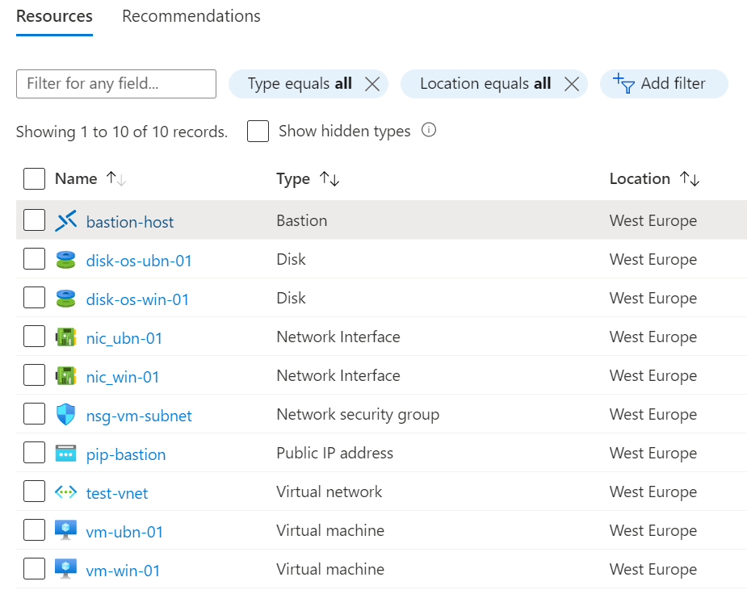
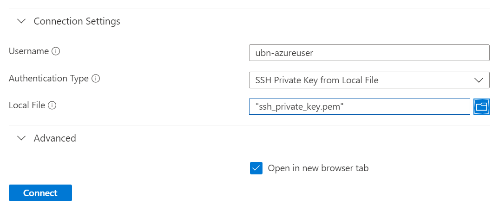
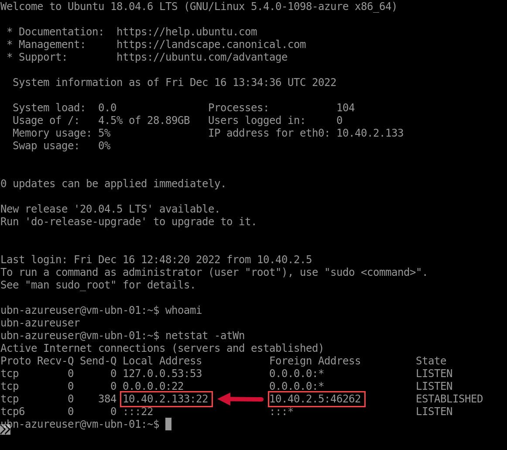
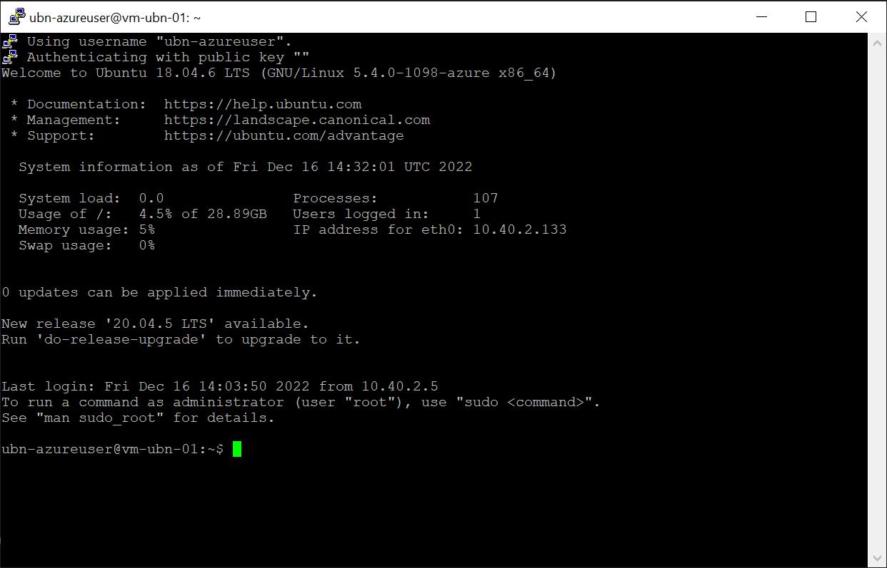
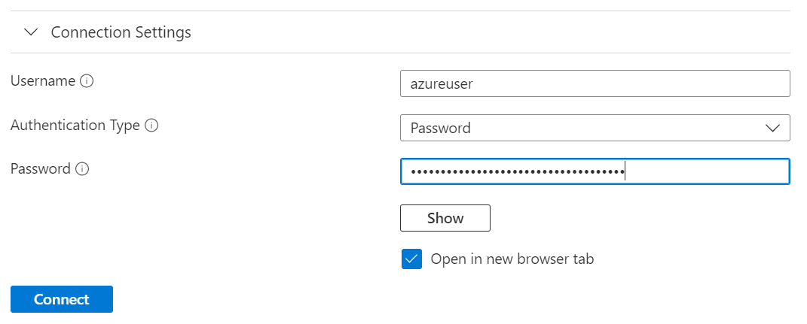
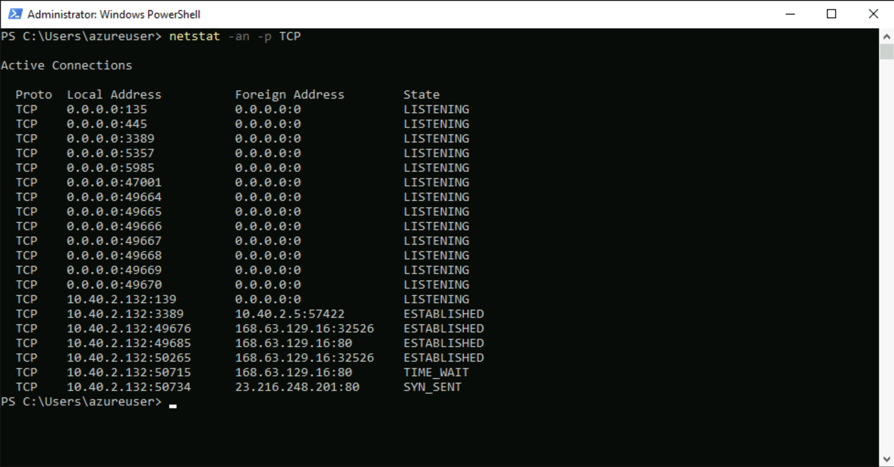

# Test Azure Bastion

The steps in this document can be used to create a test environment for Azure Bastion and test the corresponding functionality.

Objectives:

- restrict inbound and outbound network traffic as much as possible, and
- use native clients.

## Prepare the Provider and Create the Resource Group

Provider and Resource Group terraform files are here:

- [provider.tf](provider.tf)
- [resourcegroup.tf](resourcegroup.tf)

As the very first step, the terraform providers need to be added and the destination resource group needs to be created.

```terraform
terraform {
  required_providers {
    azurerm = {
      source = "hashicorp/azurerm"
    }
    tls = {
      source = "hashicorp/tls"
    }
  }
}

provider "azurerm" {
  features {}
}
```

As for the resource group, the following terraform code can be used.

```terraform
resource "azurerm_resource_group" "rg" {
  location = "westeurope"
  name     = "bastion-test-rg"
  tags = {
    owner       = "me"
    environment = "test"
  }
}
```

## Create the Networking Configuration

The terraform files for the networking configuration can be seen here:

- [network.tf](network.tf)

### Virtual Network

The below code would create the Virtual Network itself as well as two subnets. Note that [Azure Bastion requires a subnet](https://learn.microsoft.com/en-us/azure/bastion/configuration-settings#subnet) with the name  `AzureBastionSubnet` to be created and it must be of size `/26` as a minimum. [1]

```terraform
# Create virtual network
resource "azurerm_virtual_network" "vnet" {
  name                = "test-vnet"
  address_space       = ["10.40.2.0/24"]
  location            = azurerm_resource_group.rg.location
  resource_group_name = azurerm_resource_group.rg.name
  tags = {
    owner       = "me"
    environment = "test"
  }
}

# Create subnets
resource "azurerm_subnet" "bastion_subnet" {
  name                 = "AzureBastionSubnet"
  resource_group_name  = azurerm_resource_group.rg.name
  virtual_network_name = azurerm_virtual_network.vnet.name
  address_prefixes     = ["10.40.2.0/25"]
}

resource "azurerm_subnet" "vm_subnet" {
  name                 = "vm-subnet"
  resource_group_name  = azurerm_resource_group.rg.name
  virtual_network_name = azurerm_virtual_network.vnet.name
  address_prefixes     = ["10.40.2.128/25"]
}
```

### Network Security Group

The testing scenario should only allow network connections that are absolutely required. General inbound/outbound network traffic should be avoided. Therefore, the Network Security Group includes only the following rules:

- RDP and SSH traffic is allowed inbound from the Azure Bastion subnet, so that Azure Bastion can connect to the virtual machines
- Any other inbound traffic is denied
- Outbound traffic is allowed into the VM subnet so that VMs within the subnet could communicate
- Any other outbound traffic is denied

As last step in belows terraform configuration, the Network Security Group is associated with the VM subnet.

```terraform
# Create Network Security Group for VM Subnet and the corresponding rule for RDP from Azure Bastion
resource "azurerm_network_security_group" "vm_subnet_nsg" {
  name                = "nsg-vm-subnet"
  location            = azurerm_resource_group.rg.location
  resource_group_name = azurerm_resource_group.rg.name
  tags = {
    owner       = "me"
    environment = "test"
  }
}

resource "azurerm_network_security_rule" "inbound_allow_rdp" {
  network_security_group_name = azurerm_network_security_group.vm_subnet_nsg.name
  resource_group_name         = azurerm_resource_group.rg.name
  name                        = "Inbound_Allow_Bastion_RDP"
  priority                    = 500
  direction                   = "Inbound"
  access                      = "Allow"
  protocol                    = "Tcp"
  source_port_range           = "*"
  destination_port_range      = "3389"
  source_address_prefix       = azurerm_subnet.bastion_subnet.address_prefixes[0]
  destination_address_prefix  = azurerm_subnet.vm_subnet.address_prefixes[0]
}

resource "azurerm_network_security_rule" "inbound_allow_ssh" {
  network_security_group_name = azurerm_network_security_group.vm_subnet_nsg.name
  resource_group_name         = azurerm_resource_group.rg.name
  name                        = "Inbound_Allow_Bastion_SSH"
  priority                    = 510
  direction                   = "Inbound"
  access                      = "Allow"
  protocol                    = "Tcp"
  source_port_range           = "*"
  destination_port_range      = "22"
  source_address_prefix       = azurerm_subnet.bastion_subnet.address_prefixes[0]
  destination_address_prefix  = azurerm_subnet.vm_subnet.address_prefixes[0]
}

resource "azurerm_network_security_rule" "inbound_deny_all" {
  network_security_group_name = azurerm_network_security_group.vm_subnet_nsg.name
  resource_group_name         = azurerm_resource_group.rg.name
  name                        = "Inbound_Deny_Any_Any"
  priority                    = 1000
  direction                   = "Inbound"
  access                      = "Deny"
  protocol                    = "*"
  source_port_range           = "*"
  destination_port_range      = "*"
  source_address_prefix       = "*"
  destination_address_prefix  = azurerm_subnet.vm_subnet.address_prefixes[0]
}

resource "azurerm_network_security_rule" "outbound_allow_subnet" {
  network_security_group_name = azurerm_network_security_group.vm_subnet_nsg.name
  resource_group_name         = azurerm_resource_group.rg.name
  name                        = "Outbound_Allow_Subnet_Any"
  priority                    = 500
  direction                   = "Outbound"
  access                      = "Allow"
  protocol                    = "*"
  source_port_range           = "*"
  destination_port_range      = "*"
  source_address_prefix       = azurerm_subnet.vm_subnet.address_prefixes[0]
  destination_address_prefix  = azurerm_subnet.vm_subnet.address_prefixes[0]
}

resource "azurerm_network_security_rule" "outbound_deny_all" {
  network_security_group_name = azurerm_network_security_group.vm_subnet_nsg.name
  resource_group_name         = azurerm_resource_group.rg.name
  name                        = "Outbound_Deny_Any_Any"
  priority                    = 1000
  direction                   = "Outbound"
  access                      = "Deny"
  protocol                    = "*"
  source_port_range           = "*"
  destination_port_range      = "*"
  source_address_prefix       = azurerm_subnet.vm_subnet.address_prefixes[0]
  destination_address_prefix  = "*"
}

resource "azurerm_subnet_network_security_group_association" "nsg_vm_subnet_association" {
  network_security_group_id = azurerm_network_security_group.vm_subnet_nsg.id
  subnet_id                 = azurerm_subnet.vm_subnet.id
}
```

## Virtual Machines

In order to be able to test RDP as well as SSH sessions, one Linux (Ubuntu) and one Windows (Windows Server 2022) are deployed.
The terraform files for both VMs are:

- [ssh_key.tf](ssh_key.tf)
- [vm_linux.tf](vm_linux.tf)
- [vm_windows.tf](vm_windows.tf)

### Linux Virtual Machine (Ubuntu)

For the Linux VM an Ubuntu 18.04-LTS was chosen. In order to be able to login after the deployment, an SSH key must be created during deployment time.

```terraform
# Create an SSH key
resource "tls_private_key" "ubn_ssh" {
  algorithm = "RSA"
  rsa_bits  = 4096
}
```

Subsequently, the network interface and the VM resource can be created.

```terraform
# Create network interface
resource "azurerm_network_interface" "nic_ubn_01" {
  name                = "nic_ubn-01"
  location            = azurerm_resource_group.rg.location
  resource_group_name = azurerm_resource_group.rg.name

  ip_configuration {
    name                          = "nic_ubn-01-configuration"
    subnet_id                     = azurerm_subnet.vm_subnet.id
    private_ip_address_allocation = "Dynamic"
  }
}

# Create virtual machine
resource "azurerm_linux_virtual_machine" "vm_ubn_01" {
  name                  = "vm-ubn-01"
  location              = azurerm_resource_group.rg.location
  resource_group_name   = azurerm_resource_group.rg.name
  network_interface_ids = [azurerm_network_interface.nic_ubn_01.id]
  size                  = "Standard_DS1_v2"

  os_disk {
    name                 = "disk-os-ubn-01"
    caching              = "ReadWrite"
    storage_account_type = "Premium_LRS"
  }

  source_image_reference {
    publisher = "Canonical"
    offer     = "UbuntuServer"
    sku       = "18.04-LTS"
    version   = "latest"
  }

  computer_name                   = "vm-ubn-01"
  admin_username                  = "ubn-azureuser"
  disable_password_authentication = true

  admin_ssh_key {
    username   = "ubn-azureuser"
    public_key = tls_private_key.ubn_ssh.public_key_openssh
  }
}
```

### Windows Virtual Machine (Windows Server 2022)

The Windows Virtual Machine will be created similarly - an SSH key is obviously not required in this case. Not that the values for `admin_username` and `admin_password` are stored separately in a variable file, which is why only the references are visible in the configuration below.

```terraform
# Create network interface
resource "azurerm_network_interface" "nic_win_01" {
  name                = "nic_win-01"
  location            = azurerm_resource_group.rg.location
  resource_group_name = azurerm_resource_group.rg.name

  ip_configuration {
    name                          = "nic_win-01-configuration"
    subnet_id                     = azurerm_subnet.vm_subnet.id
    private_ip_address_allocation = "Dynamic"
  }
}

resource "azurerm_windows_virtual_machine" "vm-win-01" {
  name                = "vm-win-01"
  resource_group_name = azurerm_resource_group.rg.name
  location            = azurerm_resource_group.rg.location
  size                = "Standard_DS2_v2"
  admin_username      = var.admin_username
  admin_password      = var.admin_password
  network_interface_ids = [
    azurerm_network_interface.nic_win_01.id
  ]

  os_disk {
    name                 = "disk-os-win-01"
    caching              = "ReadWrite"
    storage_account_type = "Standard_LRS"
  }

  source_image_reference {
    publisher = "MicrosoftWindowsServer"
    offer     = "WindowsServer"
    sku       = "2022-Datacenter"
    version   = "latest"
  }
}
```

## Configure Azure Bastion

As the very last step, Azure Bastion can be deployed. The terraform file can be found her:

- [bastion.tf](bastion.tf)
 
For testing purposes the `Standard` SKU is used so that tunneling capabilities for using native clients are provided. The core capability of this SKU is the ability to scale up to 50 scale units - however, for this testing scenario, this is not relevant and only the minimum of 2 scale units should be configured.
Other than that, Azure Bastion requires a Public IP address against which the Azure Portal will connect incoming requests. For a full diagram of the connectivity flow for Azure Bastion, see the [Azure Bastion Networking documentation](https://learn.microsoft.com/en-gb/azure/bastion/connect-ip-address). [2]

```terraform
resource "azurerm_public_ip" "bastion_pip" {
  name                = "pip-bastion"
  location            = azurerm_resource_group.rg.location
  resource_group_name = azurerm_resource_group.rg.name
  allocation_method   = "Static"
  sku                 = "Standard"
}

resource "azurerm_bastion_host" "bastion_host" {
  name                = "bastion-host"
  location            = azurerm_resource_group.rg.location
  resource_group_name = azurerm_resource_group.rg.name
  sku                 = "Standard"
  scale_units         = 2

  copy_paste_enabled     = true
  file_copy_enabled      = true
  shareable_link_enabled = true
  tunneling_enabled      = true

  ip_configuration {
    name                 = "config-01"
    subnet_id            = azurerm_subnet.bastion_subnet.id
    public_ip_address_id = azurerm_public_ip.bastion_pip.id
  }
}
```

## Deploying the Resources

Once the configuration is finalized, the deployment can be performed by executing `terraform init`,  `terraform plan` and finally `terraform apply`. This should result in all resources to be created.

```terraform
Apply complete! Resources: 18 added, 0 changed, 0 destroyed.
```

Subsequently the Azure Portal can be checked to verify that the resources were created successfully.



## Accessing the Virtual Machines through Azure Bastion

### SSH Access into Linux

Using the Azure Portal, it is now possible to login to the corresponding VM through Azure Bastion through the webbrowser.


On the login page of Azure Bastion, the previously created private key needs to be supplied via a file (or through Azure Key Vault).



Once logged-in, `netstat -atWn` reveals that only one private network connection from the Azure Bastion Node `10.40.2.5` is esablished against port 22 of the Ubuntu VM.



For connecting through the command line, the SSH CLI extension is required. It can be installed by executing this command:

```azurecli
$ az extension add --name ssh
```

Once the extension is installed, the tunnel can be created and SSH connection can be established natively.

```azurecli
$ az network bastion ssh --name bastion-host --resource-group bastion-test-rg --target-resource-id /subscriptions/{subscription-id}/resourceGroups/bastion-test-rg/providers/Microsoft.Compute/virtualMachines/vm-ubn-01 --auth-type "ssh-key" --username ubn-azureuser --ssh-key .\ssh_private_key.pem
```

This should result in a successful login.

```bash
Command group 'network bastion' is in preview and under development. Reference and support levels: https://aka.ms/CLI_refstatus
Welcome to Ubuntu 18.04.6 LTS (GNU/Linux 5.4.0-1098-azure x86_64)

 * Documentation:  https://help.ubuntu.com
 * Management:     https://landscape.canonical.com
 * Support:        https://ubuntu.com/advantage

  System information as of Fri Dec 16 14:03:50 UTC 2022

  System load:  0.07              Processes:           108
  Usage of /:   4.5% of 28.89GB   Users logged in:     1
  Memory usage: 5%                IP address for eth0: 10.40.2.133
  Swap usage:   0%


0 updates can be applied immediately.

New release '20.04.5 LTS' available.
Run 'do-release-upgrade' to upgrade to it.


Last login: Fri Dec 16 13:34:37 2022 from 10.40.2.5
To run a command as administrator (user "root"), use "sudo <command>".
See "man sudo_root" for details.

ubn-azureuser@vm-ubn-01:~$
```

Again, upon verifying the active network connections, only private connections from Bastion into the Ubuntu VM are established.

```bash
ubn-azureuser@vm-ubn-01:~$ netstat -atWn
Active Internet connections (servers and established)
Proto Recv-Q Send-Q Local Address           Foreign Address         State
tcp        0      0 127.0.0.53:53           0.0.0.0:*               LISTEN
tcp        0      0 0.0.0.0:22              0.0.0.0:*               LISTEN
tcp        0    280 10.40.2.133:22          10.40.2.5:47280         ESTABLISHED
tcp        0      0 10.40.2.133:22          10.40.2.5:46262         ESTABLISHED
tcp6       0      0 :::22                   :::*                    LISTEN
```

If files need to be uploaded from the local computer to the target VM, other native clients, i.E. Putty need to be used.
In order for this to work a port forwarding from the local machine against Azure Bastion needs to be established by using the following command:

```azurecli
$ az network bastion tunnel --name bastion-host --resource-group bastion-test-rg --target-resource-id /subscriptions/{subscription-id}/resourceGroups/bastion-test-rg/providers/Microsoft.Compute/virtualMachines/vm-ubn-01 --resource-port 22 --port 52000
```

Once the tunnel is established, the console would indicate that it is waiting for incoming connectons:

```azurecli
Command group 'network bastion' is in preview and under development. Reference and support levels: https://aka.ms/CLI_refstatus
Opening tunnel on port: 52000
Tunnel is ready, connect on port 52000
Ctrl + C to close
```

Afterwards, a native tool (i.E. Putty) could be used to connect:



Note that the key needs to be converted into the PPK format using `PuttyGen` in order for the authentication to work successfully.

### RDP Access into Windows

Accessing Windows through the webbrowser works very similar, besides it is only possible to use Username/Password to login.



Windows is attempting to connect to public IP addresses but is not successful due to the restrictive NSG that was put in place. Connections to `168.63.129.16` are always successful though, since this is [a virtual public IP address that is used to facilitate a communication channel to Azure platform resources](https://learn.microsoft.com/en-us/azure/virtual-network/what-is-ip-address-168-63-129-16) [3] and is fundamental to the systems functionality.

Other than that, the connection is coming from the Azure Bastion node as expected.



Port forwarding RDP to Bastion is as easy as port forwarding SSH into Linux.

```azurecli
$ az network bastion tunnel --name bastion-host --resource-group bastion-test-rg --target-resource-id /subscriptions/{subscription-id}/resourceGroups/bastion-test-rg/providers/Microsoft.Compute/virtualMachines/vm-win-01 --resource-port 3389 --port 52000
```

Once the tunnel is established, the console would indicate that it is waiting for incoming connectons:

```azurecli
Command group 'network bastion' is in preview and under development. Reference and support levels: https://aka.ms/CLI_refstatus
Opening tunnel on port: 52000
Tunnel is ready, connect on port 52000
Ctrl + C to close
```

Now, the RDP client can be opened and pointed to `localhost:52000`. Upon entering the Windows user credentials, the RDP session would be successfully established.

## References

| # | Title | URL |
| --- | --- | --- |
| 1 | Azure Bastion Subnet | https://learn.microsoft.com/en-us/azure/bastion/configuration-settings#subnet |
| 2 | Connect to a VM via specified private IP address through the portal | https://learn.microsoft.com/en-gb/azure/bastion/connect-ip-address |
| 3 | What is IP address 168.63.129.16? | https://learn.microsoft.com/en-us/azure/virtual-network/what-is-ip-address-168-63-129-16
